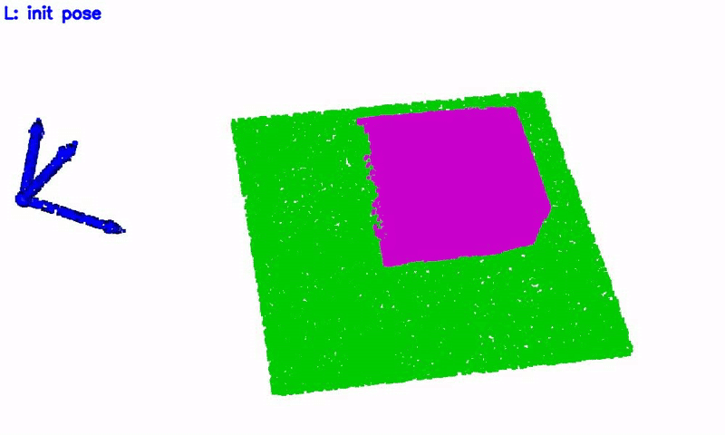

# BiDP (Bimanual Diffusion Policy)

<table>
  <tr>
    <th> Task </th>
    <th> BiDP trained without augmentation </th>
    <th> BiDP trained with augmentation </th>
  </tr>
  <tr>
    <th> Drawer </th>
    <td></td>
    <td></td> 
  </tr>
  <tr>
    <th> Pouring </th>
    <td></td>
    <td></td> 
  </tr>
  <tr>
    <th> Unscrew </th>
    <td></td>
    <td></td> 
  </tr>
  <tr>
    <th> Uncover </th>
    <td></td>
    <td></td> 
  </tr>
  <tr>
    <th> Openbox </th>
    <td></td>
    <td></td> 
  </tr>
</table>
