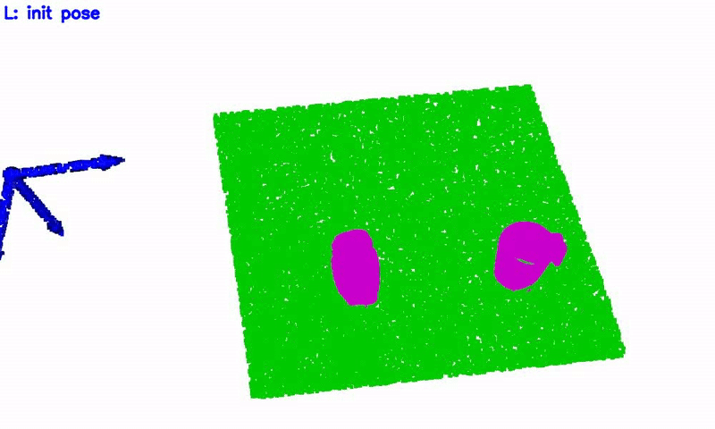
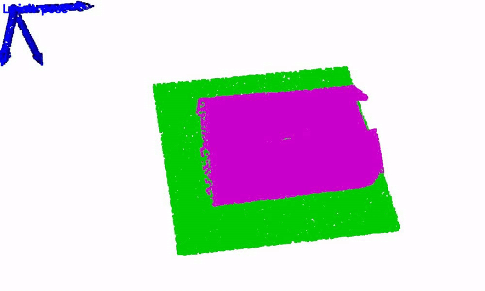

# BiDP (Bimanual Diffusion Policy)
In this part, we provide code for training BiDP models and predicting bimanual actions using pretrained models. Before that, you should prepare and download datasets following steps in [AugDemos](https://github.com/hnuzhy/YOTO/blob/main/AugDemos/README.md).

## Training
  * Our codebase is based on [EquiBot](https://github.com/yjy0625/equibot) and tested with the following setup: Ubuntu 20.04, an RTX 3090-Ti GPU and CUDA 11.8. Then, please install dependencies as follows:
```python
pip install fvcore iopath ffmpeg -c iopath -c fvcore
pip install torch==2.1.0 torchvision==0.16.0 torchaudio==2.1.0 --index-url https://download.pytorch.org/whl/cu118
pip install "git+https://github.com/facebookresearch/pytorch3d.git"
```
  Then, in the last two lines of the config file [basic.yaml](https://github.com/hnuzhy/YOTO/blob/main/BiDP/policies/configs/basic.yaml#L102), enter the wandb entity and project names for logging purposes. If you do not have a wandb account yet, you can register [here](https://wandb.ai/). Besides, please carefully check the file [dataset_loader.py](https://github.com/hnuzhy/YOTO/blob/main/BiDP/policies/datasets/dataset_loader.py) to make sure that your datasets are rightly parsed and loaded.

  * Training using datasets without augmentations (batch_size 16, num_epochs 2000/2000/4000/4000/4000)
```python
# drawer (243 demos) --> [2025-01-03 23:06:21] taking about 01 hours 21 minutes
$ python train.py --config-name basic prefix=bidp_drawer_noaug agent.agent_name=equibot env.env_class=drawer data.dataset.path=/home/dexforce/zhouhuayi/projects/BiDP/dataset data.dataset.task_name=drawer data.dataset.is_augmented=0 model.pred_horizon=12 training.batch_size=16 training.num_epochs=2000

# pouring (162 demos) --> [2025-01-04 12:25:05] taking about 00 hours 58 minutes
$ python train.py --config-name basic prefix=bidp_pouring_noaug agent.agent_name=equibot env.env_class=pouring data.dataset.path=/home/dexforce/zhouhuayi/projects/BiDP/dataset data.dataset.task_name=pouring data.dataset.is_augmented=0 model.pred_horizon=12 training.batch_size=16 training.num_epochs=2000

# unscrew (54 demos) --> [2025-01-04 15:59:49] taking about 00 hours 42 minutes
$ python train.py --config-name basic prefix=bidp_unscrew_noaug agent.agent_name=equibot env.env_class=unscrew data.dataset.path=/home/dexforce/zhouhuayi/projects/BiDP/dataset data.dataset.task_name=unscrew data.dataset.is_augmented=0 model.pred_horizon=12 training.batch_size=16 training.num_epochs=4000

# uncover (45 demos) --> [2025-01-04 16:44:32] taking about 00 hours 36 minutes
$ python train.py --config-name basic prefix=bidp_uncover_noaug agent.agent_name=equibot env.env_class=uncover data.dataset.path=/home/dexforce/zhouhuayi/projects/BiDP/dataset data.dataset.task_name=uncover data.dataset.is_augmented=0 model.pred_horizon=24 training.batch_size=16 training.num_epochs=4000

# openbox (36 demos) --> [2025-01-04 18:06:32] taking about 00 hours 35 minutes
$ python train.py --config-name basic prefix=bidp_openbox_noaug agent.agent_name=equibot env.env_class=openbox data.dataset.path=/home/dexforce/zhouhuayi/projects/BiDP/dataset data.dataset.task_name=openbox data.dataset.is_augmented=0 model.pred_horizon=32 training.batch_size=16 training.num_epochs=4000
```

  * Training using datasets with augmentations (batch_size 16 --> 64, num_epochs 2000/2000/4000/4000/4000 --> 500/500/1000/1000/1000)
```python
# drawer (243 demos * 100) --> [2025-01-04 22:00:33] taking about 17 hours 27 minutes
$ python train.py --config-name basic prefix=bidp_drawer_withaug agent.agent_name=equibot env.env_class=drawer data.dataset.path=/home/dexforce/zhouhuayi/projects/BiDP/dataset data.dataset.task_name=drawer data.dataset.is_augmented=1 model.pred_horizon=12 training.batch_size=64 training.num_epochs=500 data.dataset.num_workers=8

# pouring (162 demos * 100) --> [2025-01-05 16:03:43] taking about 10 hours 47 minutes
$ python train.py --config-name basic prefix=bidp_pouring_withaug agent.agent_name=equibot env.env_class=pouring data.dataset.path=/home/dexforce/zhouhuayi/projects/BiDP/dataset data.dataset.task_name=pouring data.dataset.is_augmented=1 model.pred_horizon=12 training.batch_size=64 training.num_epochs=500 data.dataset.num_workers=8

# unscrew (54 demos * 100) --> [2025-01-06 07:22:43] taking about 07 hours 15 minutes
$ python train.py --config-name basic prefix=bidp_unscrew_withaug agent.agent_name=equibot env.env_class=unscrew data.dataset.path=/home/dexforce/zhouhuayi/projects/BiDP/dataset data.dataset.task_name=unscrew data.dataset.is_augmented=1 model.pred_horizon=12 training.batch_size=64 training.num_epochs=1000 data.dataset.num_workers=8

# uncover (45 demos * 100) --> [2025-01-06 15:17:52] taking about 06 hours 51 minutes
$ python train.py --config-name basic prefix=bidp_uncover_withaug agent.agent_name=equibot env.env_class=uncover data.dataset.path=/home/dexforce/zhouhuayi/projects/BiDP/dataset data.dataset.task_name=uncover data.dataset.is_augmented=1 model.pred_horizon=24 training.batch_size=64 training.num_epochs=1000 data.dataset.num_workers=8

# openbox (36 demos * 100) --> [2025-01-06 22:10:41] taking about 05 hours 49 minutes
$ python train.py --config-name basic prefix=bidp_openbox_withaug agent.agent_name=equibot env.env_class=openbox data.dataset.path=/home/dexforce/zhouhuayi/projects/BiDP/dataset data.dataset.task_name=openbox data.dataset.is_augmented=1 model.pred_horizon=32 training.batch_size=64 training.num_epochs=1000 data.dataset.num_workers=8
```

## Inference
* You can simply conduct `bash run_withaug.sh` and `bash run_noaug.sh` for fast testing. Or you can test one specific task as follows. All of our pretrained models have been uploaded to [huggingface/YOTO](https://huggingface.co/HoyerChou/YOTO/tree/main).
* For testing on the training dataset (with augmentation)
```python
$ python infer.py --config-name basic training.ckpt=/home/dexforce/zhouhuayi/projects/BiDP/logs/train/bidp_drawer_withaug/ckpt00499.pth data.dataset.path=/home/dexforce/zhouhuayi/projects/BiDP/dataset agent.agent_name=equibot env.env_class=drawer model.pred_horizon=12 data.dataset.is_transformed=0
$ python infer.py --config-name basic training.ckpt=/home/dexforce/zhouhuayi/projects/BiDP/logs/train/bidp_pouring_withaug/ckpt00499.pth data.dataset.path=/home/dexforce/zhouhuayi/projects/BiDP/dataset agent.agent_name=equibot env.env_class=pouring model.pred_horizon=12 data.dataset.is_transformed=0
$ python infer.py --config-name basic training.ckpt=/home/dexforce/zhouhuayi/projects/BiDP/logs/train/bidp_unscrew_withaug/ckpt00999.pth data.dataset.path=/home/dexforce/zhouhuayi/projects/BiDP/dataset agent.agent_name=equibot env.env_class=unscrew model.pred_horizon=12 data.dataset.is_transformed=0
$ python infer.py --config-name basic training.ckpt=/home/dexforce/zhouhuayi/projects/BiDP/logs/train/bidp_uncover_withaug/ckpt00999.pth data.dataset.path=/home/dexforce/zhouhuayi/projects/BiDP/dataset agent.agent_name=equibot env.env_class=uncover model.pred_horizon=24 data.dataset.is_transformed=0
$ python infer.py --config-name basic training.ckpt=/home/dexforce/zhouhuayi/projects/BiDP/logs/train/bidp_openbox_withaug/ckpt00999.pth data.dataset.path=/home/dexforce/zhouhuayi/projects/BiDP/dataset agent.agent_name=equibot env.env_class=openbox model.pred_horizon=32 data.dataset.is_transformed=0
```

* For testing on the training dataset (without augmentation)
```python
$ python infer.py --config-name basic training.ckpt=/home/dexforce/zhouhuayi/projects/BiDP/logs/train/bidp_drawer_noaug/ckpt01999.pth data.dataset.path=/home/dexforce/zhouhuayi/projects/BiDP/dataset agent.agent_name=equibot env.env_class=drawer model.pred_horizon=12 data.dataset.is_transformed=0
$ python infer.py --config-name basic training.ckpt=/home/dexforce/zhouhuayi/projects/BiDP/logs/train/bidp_pouring_noaug/ckpt01999.pth data.dataset.path=/home/dexforce/zhouhuayi/projects/BiDP/dataset agent.agent_name=equibot env.env_class=pouring model.pred_horizon=12 data.dataset.is_transformed=0
$ python infer.py --config-name basic training.ckpt=/home/dexforce/zhouhuayi/projects/BiDP/logs/train/bidp_unscrew_noaug/ckpt03999.pth data.dataset.path=/home/dexforce/zhouhuayi/projects/BiDP/dataset agent.agent_name=equibot env.env_class=unscrew model.pred_horizon=12 data.dataset.is_transformed=0
$ python infer.py --config-name basic training.ckpt=/home/dexforce/zhouhuayi/projects/BiDP/logs/train/bidp_uncover_noaug/ckpt03999.pth data.dataset.path=/home/dexforce/zhouhuayi/projects/BiDP/dataset agent.agent_name=equibot env.env_class=uncover model.pred_horizon=24 data.dataset.is_transformed=0
$ python infer.py --config-name basic training.ckpt=/home/dexforce/zhouhuayi/projects/BiDP/logs/train/bidp_openbox_noaug/ckpt03999.pth data.dataset.path=/home/dexforce/zhouhuayi/projects/BiDP/dataset agent.agent_name=equibot env.env_class=openbox model.pred_horizon=32 data.dataset.is_transformed=0
```

* Below, we present some prediction results comparison of trained models with / without using augmentation for each task. More details of visualization can be found in file [infer.py](https://github.com/hnuzhy/YOTO/blob/main/BiDP/infer.py). 
* *It can be clearly seen that the augmented data can make the model prediction error significantly smaller.*
* Specifically, we use $$\color{green}green$$ point clouds to represent the platform (which does not appear in the observation input) for easy visualization, and $$\color{magenta}magenta$$ to represent the point clouds of the manipulated objects. The $$\color{blue}blue$$ and $$\color{red}red$$ colored 6-DoF keyposes represent the end-effector actions of the left and right arms, respectively. The far left and far right keyposes are initial robot states. The ground-truth 6-DoF keyposes have larger size than those predicted actions.

<table>
  <tr>
    <th> Task </th>
    <th> BiDP trained without augmentation </th>
    <th> BiDP trained with augmentation </th>
  </tr>
  <tr>
    <th> Drawer </th>
    <td></td>
    <td></td> 
  </tr>
  <tr>
    <th> Pouring </th>
    <td></td>
    <td></td> 
  </tr>
  <tr>
    <th> Unscrew </th>
    <td></td>
    <td></td> 
  </tr>
  <tr>
    <th> Uncover </th>
    <td></td>
    <td></td> 
  </tr>
  <tr>
    <th> Openbox </th>
    <td></td>
    <td></td> 
  </tr>
</table>
