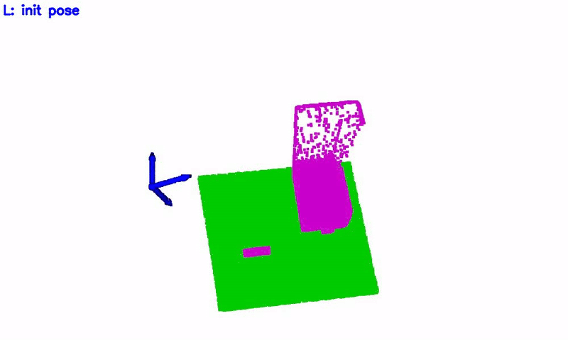
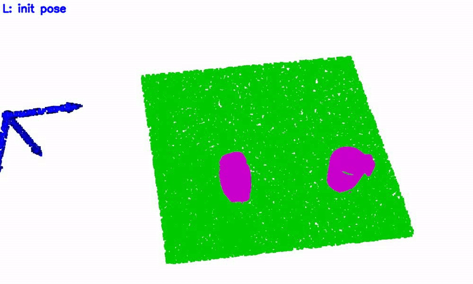
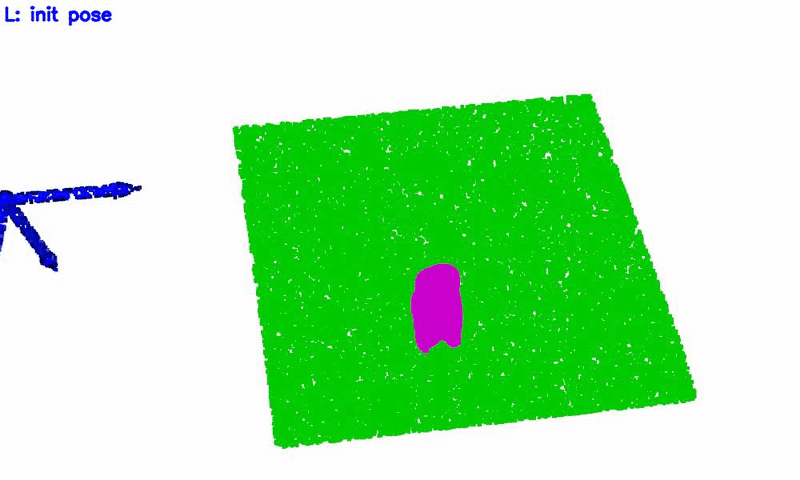
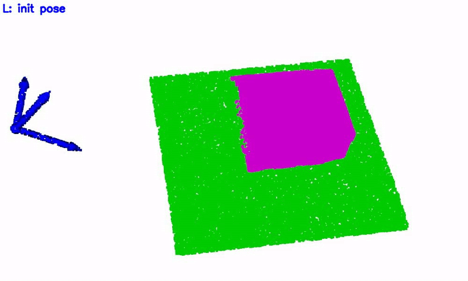
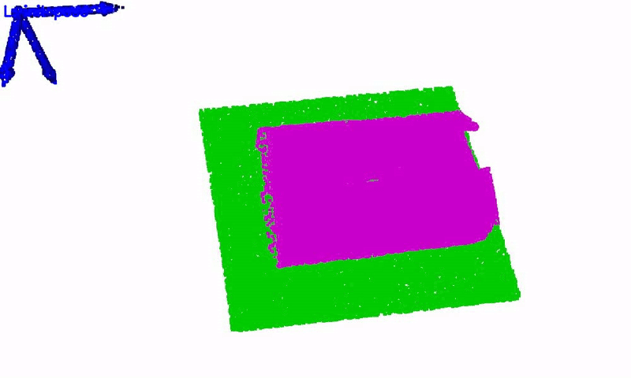
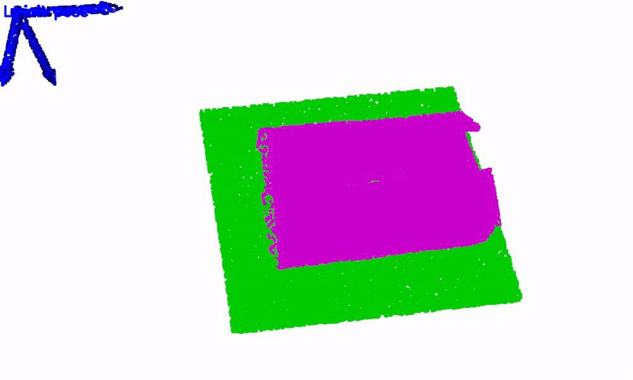

# YOTO
Code for my paper "*You Only Teach Once: Learn One-Shot Bimanual Robotic Manipulation from Video Demonstrations*" [[arXiv](https://arxiv.org/abs/2501.14208)] / [[Project](https://hnuzhy.github.io/projects/YOTO/)] / [[Dataset](https://huggingface.co/HoyerChou/YOTO)] (coming soon)

- :white_check_mark: [**2025-03-10**] We have uploaded our preprocessed datasets and pretrained models in [huggingface/YOTO](https://huggingface.co/HoyerChou/YOTO). Please refer [AugDemos](https://github.com/hnuzhy/YOTO/tree/main/AugDemos) and [BiDP](https://github.com/hnuzhy/YOTO/tree/main/BiDP) under this repo for the usage of them.

***

## ● Abstract 

> Bimanual robotic manipulation is a long-standing challenge of embodied intelligence due to its characteristics of dual-arm spatial-temporal coordination and high-dimensional action spaces. Previous studies rely on pre-defined action taxonomies or direct teleoperation to alleviate or circumvent these issues, often making them lack simplicity, versatility and scalability. Differently, we believe that the most effective and efficient way for teaching bimanual manipulation is learning from human demonstrated videos, where rich features such as spatial-temporal positions, dynamic postures, interaction states and dexterous transitions are available almost for free. In this work, we propose the YOTO (You Only Teach Once), which can extract and then inject patterns of bimanual actions from as few as a single binocular observation of hand movements, and teach dual robot arms various complex tasks. Furthermore, based on keyframes-based motion trajectories, we devise a subtle solution for rapidly generating training demonstrations with diverse variations of manipulated objects and their locations. These data can then be used to learn a customized bimanual diffusion policy (BiDP) across diverse scenes. In experiments, YOTO achieves impressive performance in mimicking 5 intricate long-horizon bimanual tasks, possesses strong generalization under different visual and spatial conditions, and outperforms existing visuomotor imitation learning methods in accuracy and efficiency.

## ● Inference Visualization

* Below, we present some prediction results of trained models with / without augmentation for comparison.

<table>
  <tr>
    <th> Task </th>
    <th> BiDP trained without augmentation </th>
    <th> BiDP trained with augmentation </th>
  </tr>
  <tr>
    <th> Drawer </th>
    <td></td>
    <td></td> 
  </tr>
  <tr>
    <th> Pouring </th>
    <td></td>
    <td></td> 
  </tr>
  <tr>
    <th> Unscrew </th>
    <td></td>
    <td></td> 
  </tr>
  <tr>
    <th> Uncover </th>
    <td></td>
    <td></td> 
  </tr>
  <tr>
    <th> Openbox </th>
    <td></td>
    <td></td> 
  </tr>
</table>

* *It can be clearly seen that the augmented data can make the model prediction error significantly smaller.* More videos and illustrations can be found in our [homepage](https://hnuzhy.github.io/projects/YOTO/).
* Specifically, we use $$\color{green}green$$ point clouds to represent the platform (which does not appear in the observation input) for easy visualization, and $$\color{magenta}magenta$$ to represent the point clouds of the manipulated objects. The $$\color{blue}blue$$ and $$\color{red}red$$ colored 6-DoF keyposes represent the end-effector actions of the left and right arms, respectively. The far left and far right keyposes are initial robot states. The ground-truth 6-DoF keyposes have larger size than those predicted actions.


## ● Acknowledgement
Our `hand motion extraction and injection` process relies on a variety of vison algorithms, including Hand Detection and 3D Mesh Reconstruction [WiLoR](https://github.com/rolpotamias/WiLoR), Large Vision-Language Model [Florence2](https://huggingface.co/collections/microsoft/florence-6669f44df0d87d9c3bfb76de), Segment Anything Model 2 [SAM2](https://github.com/facebookresearch/segment-anything-2) and Binocular Stereo Matching  [IGEV](https://github.com/gangweiX/IGEV). While, the codebase of our imitation learning algorithm `BiDP` is partly based on [ACT](https://github.com/tonyzhaozh/act), [Diffusion Policy](https://github.com/real-stanford/diffusion_policy), [3D Diffusion Policy](https://github.com/YanjieZe/3D-Diffusion-Policy) and [EquiBot](https://github.com/yjy0625/equibot). We thank them for their open source efforts and contributions.

## ● Citation
If you use our code or models in your research, please cite with:
```bash
@article{zhou2025you,
  title={You Only Teach Once: Learn One-Shot Bimanual Robotic Manipulation from Video Demonstrations},
  author={Zhou, Huayi and Wang, Ruixiang and Tai, Yunxin and Deng, Yueci and Liu, Guiliang and Jia, Kui},
  journal={arXiv preprint arXiv:2501.14208},
  year={2025}
}
```
