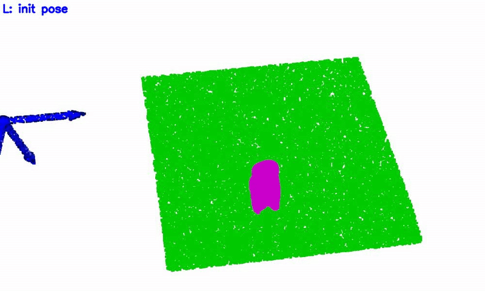

# YOTO
Code for my paper "*You Only Teach Once: Learn One-Shot Bimanual Robotic Manipulation from Video Demonstrations*" [[arXiv](https://arxiv.org/abs/2501.14208)] / [[Project](https://hnuzhy.github.io/projects/YOTO/)] / [[Dataset](https://huggingface.co/HoyerChou/YOTO)] (coming soon)

<table>
  <tr>
    <th> Task </th>
    <th> BiDP trained without augmentation </th>
    <th> BiDP trained with augmentation </th>
  </tr>
  <tr>
    <th> Drawer </th>
    <td></td>
    <td></td> 
  </tr>
  <tr>
    <th> Pouring </th>
    <td></td>
    <td></td> 
  </tr>
  <tr>
    <th> Unscrew </th>
    <td></td>
    <td></td> 
  </tr>
  <tr>
    <th> Uncover </th>
    <td></td>
    <td></td> 
  </tr>
  <tr>
    <th> Openbox </th>
    <td></td>
    <td></td> 
  </tr>
</table>
